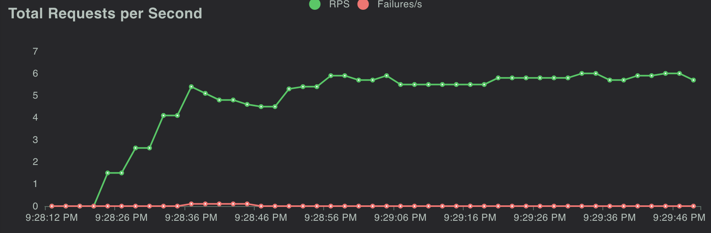
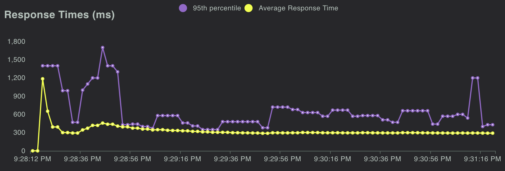

# Click Prediction Model as A Product

In [this Email Campaign Analysis project](https://github.com/wctjerry/email-campaign-analysis), I trained a Random Forest model to predict if a given user will click or not. So in order to make it a little bit more useful, it's a good idea to wrap it as a product which can be called by other business partners.


## How to use it

The model requires a few input fields to make a prediction:

* email_text
* email_version
* hour
* weekday
* user_country
* user_past_purchases

Field explanation can refer [here](https://github.com/wctjerry/email-campaign-analysis?tab=readme-ov-file#dataset-preview).

And the prediction model server will return the results:

* predicted_results: 0 or 1

`1` means the model believes the user will click whereas `0` means the user won't click. 

Here's a concreate example:

```
curl -X 'POST' \
  'http://localhost:8000/predict' \
  -H 'accept: application/json' \
  -H 'Content-Type: application/json' \
  -d '{
  "email_text": "long_email",
  "email_version": "personalized",
  "hour": 0,
  "weekday": "Monday",
  "user_country": "US",
  "user_past_purchases": 10
}'
```

We sent a POST request to the server with input fields in the body. Those input fields are:

* "email_text": "long_email",
* "email_version": "personalized",
* "hour": 0,
* "weekday": "Monday",
* "user_country": "US",
* "user_past_purchases": 10

And then the server will return the predicted results:

```
{
  "predicted_results": 1
}
```

We can see the model thinks the user tends to click.

## Technical details

Model training details can refer to the [Email Campaign Analysis](https://github.com/wctjerry/email-campaign-analysis?tab=readme-ov-file#machine-learning-model) project. Here I will focus on prediction server side. This server relies on `FastAPI` and `Docker`, and `FastAPI` leverages `Pydantic` to validate, parse and serialize data.  

`app/main.py` is where this server app is defined.

`app/models/prediction.py` stores all the `Pydantic` models.

`app/ml_models/email_click_prediction.py` stores the most important class `PredictionModel` which will load the model at the server's start time (`def load_model`) and make predictions (`def predict`).

`app/test/stress_test.py` stores a simple Lucast function to test the server performance. Here's a snapshot:



With 10 users and waiting time of 1~2 seconds, the RPS (Requests per Second) is around 6.



And the 95th response time is around 600 ms.
